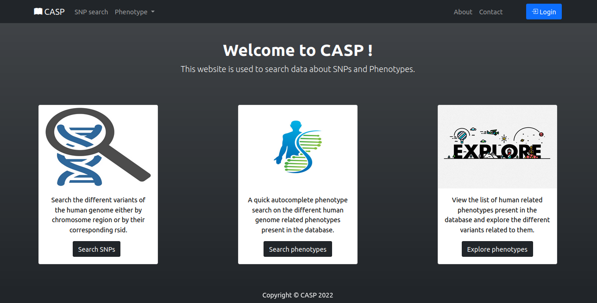
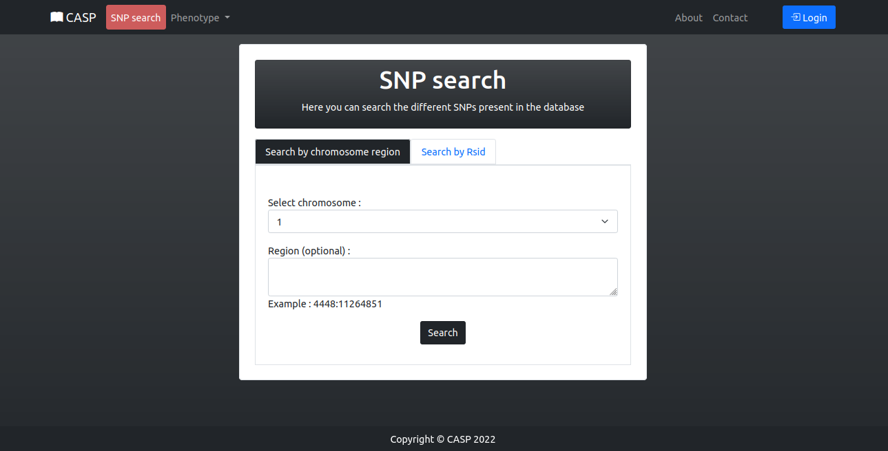
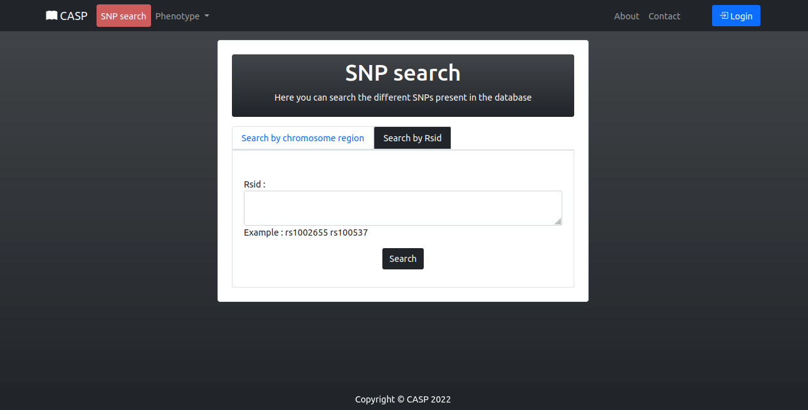
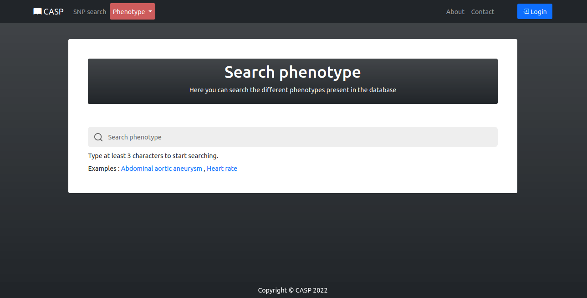
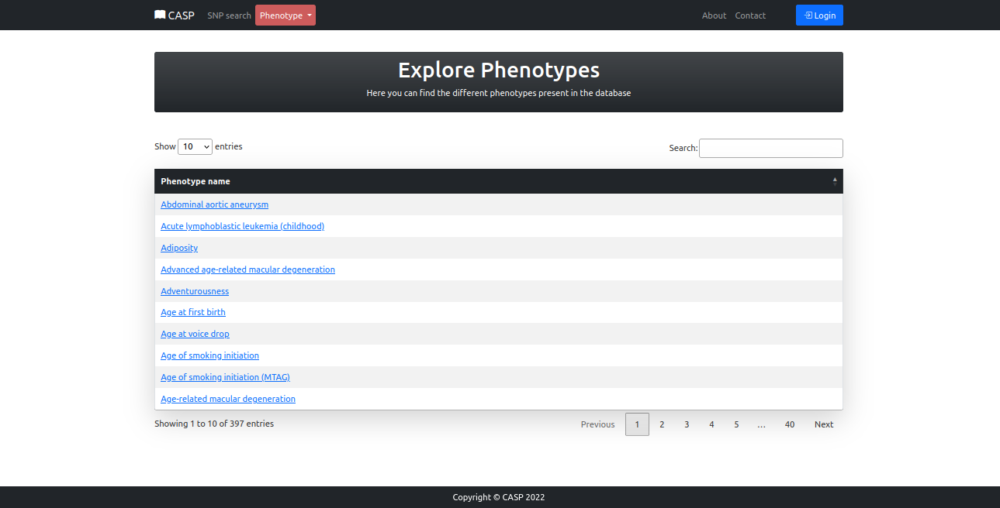
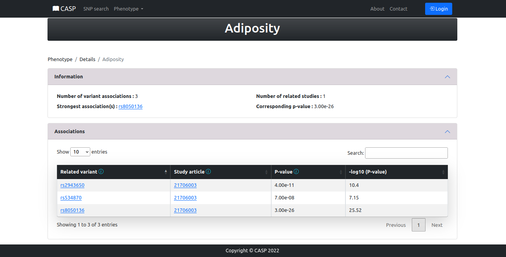
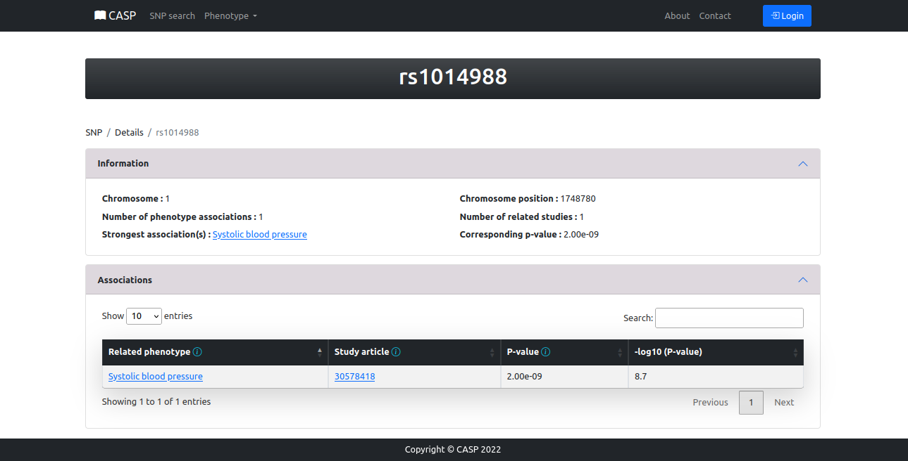

# SNP Project


[](https://forthebadge.com)
[](https://forthebadge.com)
[](https://forthebadge.com)


## About :
- This web app allows for searching a database for information about SNPs and phenotypes and their associations.

## Prerequisites :
- It is advised to install [Anaconda](https://www.anaconda.com/products/distribution) or [Miniconda](https://docs.conda.io/en/latest/miniconda.html)  on your system to run this website properly.

## Getting Started :
- Once you have the prerequisites follow these instructions :

```bash
git clone https://github.com/Ouertani95/SNP_Project
cd SNP_Project/
conda create -n snp_phenotype python=3.9
conda activate snp_phenotype
pip install -r requirements.txt
python manage.py makemigrations 
python manage.py migrate
python manage.py runserver
```

## How to use :
### I/ Data insertion :

<span style="color: salmon;">1. Inserting data using the website interface :</span>


- To manage your database and insert data you should start by creating a superuser :
```bash
python manage.py createsuperuser
```
=> Follow the instructions to create the user

- Now you can log in to insert your data
- Go to [127.0.0.1/upload/](127.0.0.1/upload/)
- Enter your superuser credentials
- Now upload your snps/phenotypes files to the database.

<span style="color: salmon;">2. Inserting data using the terminal :</span>

- It is fairly simple to add data from tsv file using the terminal
- The following command has been added to the manage.py administration script :
```bash
python manage.py upload_data path/to/tsv/file
```

### II/ Main pages :

<span style="color: salmon;">1. Home page :</span>
- Here you can find a screenshot of the home page with the different possible operations to search the database : 



<span style="color: salmon;">2. SNP search :</span>
- This is the SNP search page with the chromosome and region search :



- This is the SNP search page with the rsid list search :



<span style="color: salmon;">3. Phenotype search :</span>
- This is the phenotype search page with autocomplete for fast search and access :



<span style="color: salmon;">4. Phenotype explore :</span>
- This is the phenotype explore page to find all the phenotypes present in the database :



### III/ Results :
- Here are some example detail pages for phenotype and SNP where the first window describes information related to the element
and the second one the corresponding associations.






## Author :
**Mohamed Ouertani**